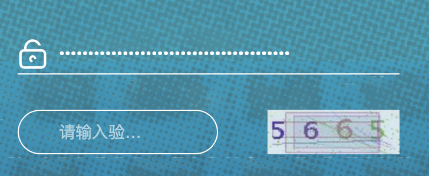
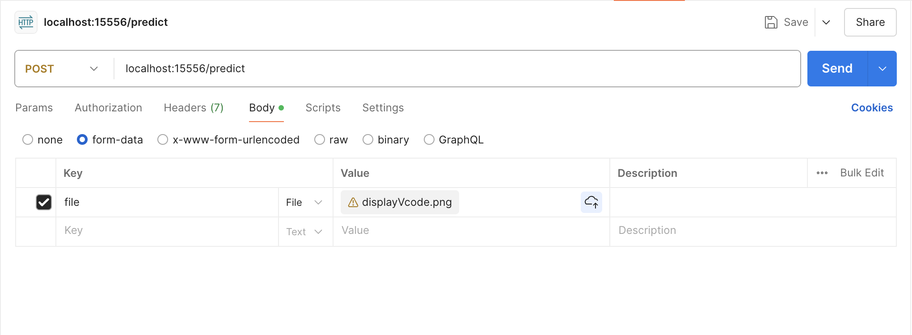

# CNN-easy-captcha-predict
CNN 实现训练了一个验证码的识别器 30MB大小 实现了对业务上验证码的精准识别 准确率 99.95%

## 需求分析
在业务上遇到了这样的验证码:



- 已经对登录的接口进行了逆向，需要对验证码进行识别。
- 验证码识别也有很多方案，但是模型太大，需要的资源过多。
- 经过测试，生成的验证码只有 四位的纯数字，但是市面上现成的模型可能会识别成字母
- 需要提供Web服务，可以挂到公网上，提供登录后返回Token

综上，训练一个很小的模型，30MB，只识别4位纯数字的、同风格的验证码。

## 技术选型
- Flask 提供Web服务
- PyTorch 个人比较顺手
- CNN 对图像任务表现成熟，而且有大量文章可以参考

# 快速开始

## 本地部署

- 训练好的模型在 model 目录
- 数据集在 data/train 和 data/test 目录
- data/train 训练集有 6000+ 标注好的
- data/test 测试集有 1000+ 标注好的

```shell
python server.py
```

## 容器部署
```shell
docker run -d -p 15556:15556 cnn-easy-captcha
```

# 测试效果

## POSTMAN

POSTMAN 中发送 form-data 请求，附带file为你的图片即可



## Python

在你启动 server.py 之后，Flask会提供API接口出来，你可以通过下面的Python代码来测试效果：
```python
import requests
import json

headers = {}
img_url = "你的图片URL"
base_ocr_url = "http://localhost:15556/predict"

img_resp = requests.get(img_url, headers=headers, stream=True)
files = {
    "file": img_resp.content
}
# form-data 请求方式 将流传输给服务
ocr_resp = requests.post(base_ocr_url, files=files)
ocr_json = json.loads(ocr_resp.text)
print(ocr_json['predict'])

```


# 文件目录
```shell
.
├── Dockerfile
├── LICENSE
|── data 数据集目录（小文件太多，就不全放了）
|── images MD文档中用到的图片
├── README.md
├── captcha_cnn.py CNN结构的定义
├── captcha_dataset.py 数据集结构的定义
├── model 模型训练结果
│   └── captcha_model_1000_ry.pth 训练了1000轮的模型
├── requirements.txt 依赖项
└── server.py 启动主程序
└── cnn_train.py 训练脚本
```

# 代码解析
## CNN网络

```python
class CaptchaCNN(nn.Module):
    def __init__(self):
        super(CaptchaCNN, self).__init__()
        self.conv1 = nn.Conv2d(3, 32, kernel_size=3, stride=1, padding=1)
        self.conv2 = nn.Conv2d(32, 64, kernel_size=3, stride=1, padding=1)
        self.conv3 = nn.Conv2d(64, 128, kernel_size=3, stride=1, padding=1)
        self.fc1 = nn.Linear(128 * 14 * 4, 1024)
        # 添加Dropout层
        self.dropout = nn.Dropout(0.5)  
        self.fc2 = nn.Linear(1024, 4 * 10)

    def forward(self, x):
        x = nn.ReLU()(self.conv1(x))
        x = nn.MaxPool2d(2, 2)(x)
        x = nn.ReLU()(self.conv2(x))
        x = nn.MaxPool2d(2, 2)(x)
        x = nn.ReLU()(self.conv3(x))
        x = nn.MaxPool2d(2, 2)(x)
        x = x.view(-1, 128 * 14 * 4)
        x = nn.ReLU()(self.fc1(x))
        x = self.dropout(x)  # 应用Dropout
        x = self.fc2(x)
        x = x.view(-1, 4, 10)
        return x
```

### conv1 卷积层1
- 输入通道 3（RGB彩色图像是3，黑白灰度图是1）
- 输出通道 32 （产生32个特征图）
- 卷积核大小 3*3
- 步长 1
- 填充 1

### conv2 卷积层2
- 输入通道 32 （第一层输出32）
- 输出通道 64（产生64个特征图）
- 其余同上

### conv2 卷积层3
- 输入通道 64（第二层输出64）
- 输出通道 128 
- 其余同上

### fc1 全连接层
- 输入节点数：128 * 14 * 4（第三层输出128，验证码大小112*38，经过三次2x2的池化，每次池化尺寸缩小一半，最终为：14*4）
- 输出节点数：1024 超参数，输出神经元数量

### dropout 层
- 随机丢弃一半的神经元，防止过拟合

### fc2 全连接层
- 输入节点数：1024 （fc1输出节点数）
- 输出节点数：4 * 10 （验证码是4位数字，每一位都可能是0-9情况）


## 数据定义
```python
class CaptchaDataset(Dataset):
    def __init__(self, img_dir, labels, transform=None):
        self.img_dir = img_dir
        self.labels = labels
        self.transform = transform

    def __len__(self):
        return len(self.labels)

    def __getitem__(self, idx):
        img_name, label_str = self.labels[idx]
        img_path = os.path.join(self.img_dir, img_name)
        image = Image.open(img_path).convert("RGB")
        # 转换为整数列表
        label = [int(char) for char in label_str]
        if self.transform:
            image = self.transform(image)
        return image, torch.tensor(label)

```

## 训练模型
cnn_train.py
```python
transform = transforms.Compose([
    transforms.Resize((38, 112)),
    # 随机旋转
    transforms.RandomRotation(10),
    # 随机平移
    transforms.RandomAffine(0, translate=(0.1, 0.1)),
    # 随机颜色扰动
    transforms.ColorJitter(brightness=0.2, contrast=0.2, saturation=0.2),
    transforms.ToTensor(),
])


# ========= 训练集 ==========
train_image_dir = 'data/train'
train_image_paths = os.listdir(train_image_dir)
# train_labels = [("image1.png", "1234"), ("image2.png", "5678")]
train_labels = []

for each_image in train_image_paths:
    each_label = str(each_image).split(".")[0]
    train_labels.append((each_image, each_label))

train_dataset = CaptchaDataset(train_image_dir, labels=train_labels, transform=transform)
train_loader = DataLoader(train_dataset, batch_size=32, shuffle=True)

# =========== 测试集 ==========
test_image_dir = 'data/test'
test_image_paths = os.listdir(test_image_dir)
test_labels = []
for each_image in test_image_paths:
    each_label = str(each_image).split(".")[0]
    test_labels.append((each_image, each_label))

test_dataset = CaptchaDataset(test_image_dir, labels=test_labels, transform=transform)
test_loader = DataLoader(test_dataset, batch_size=32, shuffle=True)


model = CaptchaCNN()
criterion = nn.CrossEntropyLoss()
optimizer = optim.Adam(model.parameters(), lr=0.0001, weight_decay=1e-4)

# 检查 MPS 支持
if torch.backends.mps.is_available():
    device = torch.device("mps")
    print("Using MPS backend")
elif torch.cuda.is_available():
    device = torch.device("cuda")
    print("Using CUDA backend")
else:
    device = torch.device("cpu")
    print("MPS and CUDA not available, using CPU")

model.to(device)

num_epochs = 4001
for epoch in range(num_epochs):
    model.train()
    running_loss = 0.0
    for images, labels in train_loader:
        # 将数据移到GPU
        images, labels = images.to(device), labels.to(device)
        optimizer.zero_grad()
        outputs = model(images)
        loss = 0
        for i in range(4):
            loss += criterion(outputs[:, i, :], labels[:, i])
        loss.backward()
        optimizer.step()
        running_loss += loss.item()

    print(f"Epoch {epoch + 1}, Loss: {running_loss / len(train_loader)}")

    if (epoch + 1) % 100 == 0:
        torch.save(model.state_dict(), f"model/captcha_model_{epoch + 1}.pth")

    model.eval()
    val_loss = 0.0
    correct = 0
    total = 0
    with torch.no_grad():
        for images, labels in test_loader:
            images, labels = images.to(device), labels.to(device)
            outputs = model(images)
            loss = 0
            for i in range(4):
                loss += criterion(outputs[:, i, :], labels[:, i])
            val_loss += loss.item()
            _, predicted = torch.max(outputs, 2)
            total += labels.size(0) * 4  # 总字符数
            correct += (predicted == labels).sum().item()

    val_loss /= len(test_loader)
    print(f"Validation Loss: {val_loss}, Accuracy: {100 * correct / total}%")

```

### transform
- transforms.Resize((38, 112)) 图片的大小
- transforms.RandomRotation(10) 增加旋转 提高泛化能力
- transforms.RandomAffine(0, translate=(0.1, 0.1)) 移动 提高泛化能力
- 其他同上


## 预测服务 
server.py
```python

```